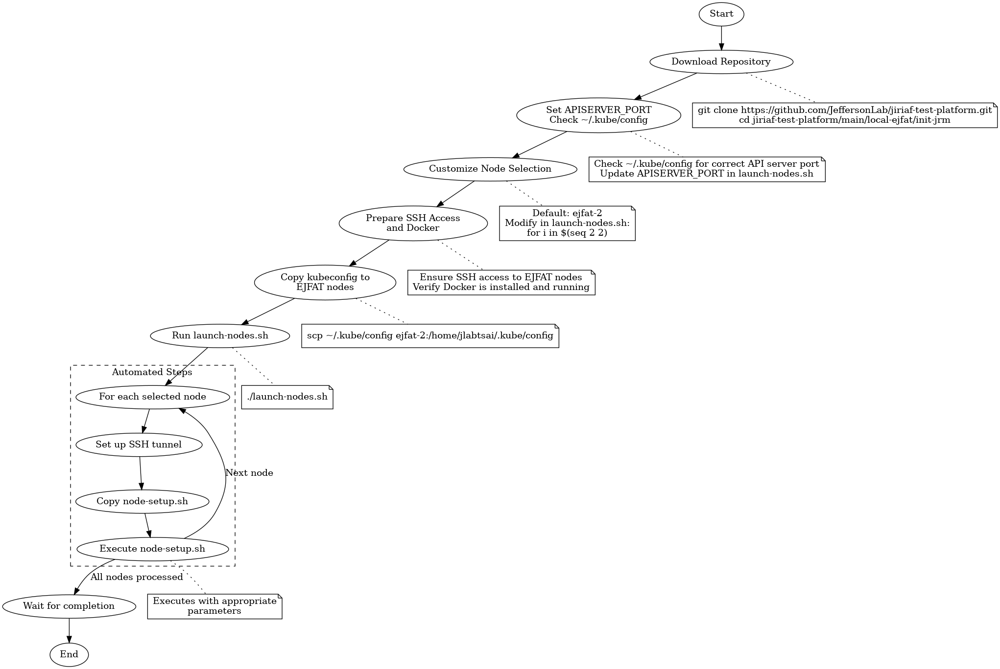

# EJFAT Node Initialization

This directory contains scripts for initializing JRMs on EJFAT nodes.

## Key Files

1. `node-setup.sh`: Sets up individual EJFAT nodes.
2. `launch-nodes.sh`: Launches EJFAT nodes.

## Step-by-Step Usage

The following flow chart illustrates the EJFAT node initialization process:



This diagram provides a visual representation of the steps involved in setting up and launching JRMs on EJFAT nodes.


1. **Set API Server Port**
   The `APISERVER_PORT` is set to 38687 in `launch-nodes.sh`. Ensure this port is available and matches your Kubernetes API server configuration.

2. **Customize Node Selection (Optional)**
   By default, the script initializes only `ejfat-2`. To change this:
   - Open `launch-nodes.sh` in a text editor.
   - Locate the line: `for i in $(seq 2 2)`
   - Modify the numbers to select different nodes. For example:
     - `$(seq 1 3)` initializes nodes 1, 2, and 3.
     - `$(seq 5 7)` initializes nodes 5, 6, and 7.

3. **Prepare SSH Access**
   Ensure you have SSH access to the EJFAT nodes you intend to initialize.

4. **Run the Launch Script**
   Execute the `launch-nodes.sh` script:
   ```bash
   ./launch-nodes.sh
   ```

5. **Script Execution Process**
   For each selected node, the script will:
   - Set up an SSH tunnel for port forwarding.
   - Copy `node-setup.sh` to the target node.
   - Execute `node-setup.sh` on the node with appropriate parameters.

6. **Wait for Completion**
   The script will wait for all node setup processes to complete.

## Special Cases

- Node 7 is treated as a special case and renamed to "fs". If you're including node 7, be aware of this naming convention in the script.

## Troubleshooting

If you encounter issues:
1. Verify SSH connectivity to the target nodes.
2. Check if port 38687 is available on both local and remote machines.
3. Ensure `node-setup.sh` is present in the same directory as `launch-nodes.sh`.

For more detailed information, refer to the comments in `launch-nodes.sh` and `node-setup.sh`.
