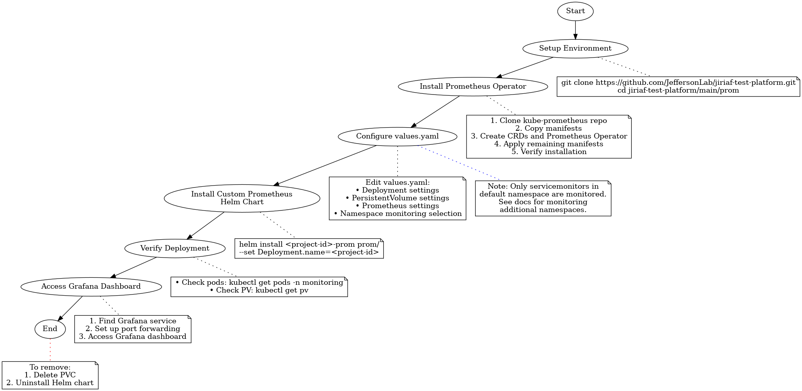

# Deploy Prometheus Monitoring with Prometheus Operator

This guide outlines the deployment process for a custom Prometheus monitoring setup using the Prometheus Operator.

## Prerequisites

Ensure your Kubernetes cluster has:

1. [Prometheus Operator](https://github.com/prometheus-operator/prometheus-operator#quickstart)
2. [Kubernetes Metrics Server](https://github.com/kubernetes-sigs/metrics-server#installation)
3. [Helm](https://helm.sh/docs/intro/install/)


## Deployment Flow Chart

Below is a visual representation of the Prometheus deployment process:



This flow chart illustrates the key steps in deploying Prometheus monitoring using the Prometheus Operator.


## Deployment Steps

1. **Setup Environment**:
   Clone the repository and navigate to the `prom` folder:
   ```bash
   git clone https://github.com/JeffersonLab/jiriaf-test-platform.git
   cd jiriaf-test-platform/main/prom
   ```

2. **Install Prometheus Operator**:
   First, we need to install the Prometheus Operator:

   a. Create a namespace for monitoring:
      ```bash
      kubectl create namespace monitoring
      ```

   b. Add the Prometheus Operator Helm repository:
      ```bash
      helm repo add prometheus-community https://prometheus-community.github.io/helm-charts
      helm repo update
      ```

   c. Install the Prometheus Operator:
      ```bash
      helm install prometheus-operator prometheus-community/kube-prometheus-stack -n monitoring
      ```

   d. Verify the installation:
      ```bash
      kubectl get pods -n monitoring
      ```

2. **Configure Values**: 
   Edit `values.yaml` to set your specific configuration:

   ```yaml
   Deployment:
     name: <project-id>
     namespace: default
   
   PersistentVolume:
     node: jiriaf2302-control-plane
     path: /var/prom
     size: 5Gi
   
   Prometheus:
     serviceaccount: prometheus-k8s
     namespace: monitoring
   ```

   Key configurations:
   - `Deployment.name`: Used for job naming, persistent volume path, and service monitoring selection
   - `Deployment.namespace`: Specifies job namespace and namespace monitoring selection
   - `PersistentVolume.*`: Configures storage for Prometheus data
   - `Prometheus.*`: Sets Prometheus server details

   Note: Only those `servicemonitors` with the namespace `default` can be monitored. To monitor additional namespaces, additional configuration is required. Refer to the [Prometheus Operator documentation on customizations](https://github.com/prometheus-operator/kube-prometheus/blob/main/docs/customizations/monitoring-additional-namespaces.md) for details.

3. **Install the Custom Prometheus Helm Chart**:
   Run the following command, replacing `<project-id>` with your identifier:

   ```bash
   helm install <project-id>-prom prom/ --set Deployment.name=<project-id>
   ```

   Example:
   ```bash
   ID=jlab-100g-nersc-ornl
   helm install $ID-prom prom/ --set Deployment.name=$ID
   ```

4. **Verify Deployment**:
   Check that all components are running:
   ```bash
   kubectl get pods -n monitoring
   kubectl get pv
   ```

5. **Access Grafana Dashboard**:
   a. Find the Grafana service:
      ```bash
      kubectl get svc -n monitoring
      ```
   b. Set up port forwarding:
      ```bash
      kubectl port-forward svc/prometheus-operator-grafana -n monitoring 3000:80
      ```
   c. Access Grafana at `http://localhost:3000` (default credentials: admin/admin)

## Components Deployed

- Prometheus Server (`prometheus.yaml`)
- Persistent Volume for data storage (`prom-pv.yaml`)
- Empty directory creation job (`prom-create_emptydir.yaml`)

## Integration with Workflows

This setup is designed to monitor services and jobs created by your workflow system.

## Advanced Configuration

For further customization, refer to the Helm chart templates and `values.yaml`. Ensure your cluster has the necessary permissions and resources for persistent volumes and Prometheus server operation.

## Troubleshooting

If you encounter issues:
1. Check pod status: `kubectl get pods -n monitoring`
2. View pod logs: `kubectl logs <pod-name> -n monitoring`
3. Ensure persistent volume is correctly bound: `kubectl get pv`
4. Verify Prometheus configuration: `kubectl get prometheus -n monitoring -o yaml`

For more help, consult the [Prometheus Operator documentation](https://github.com/prometheus-operator/prometheus-operator/tree/main/Documentation).