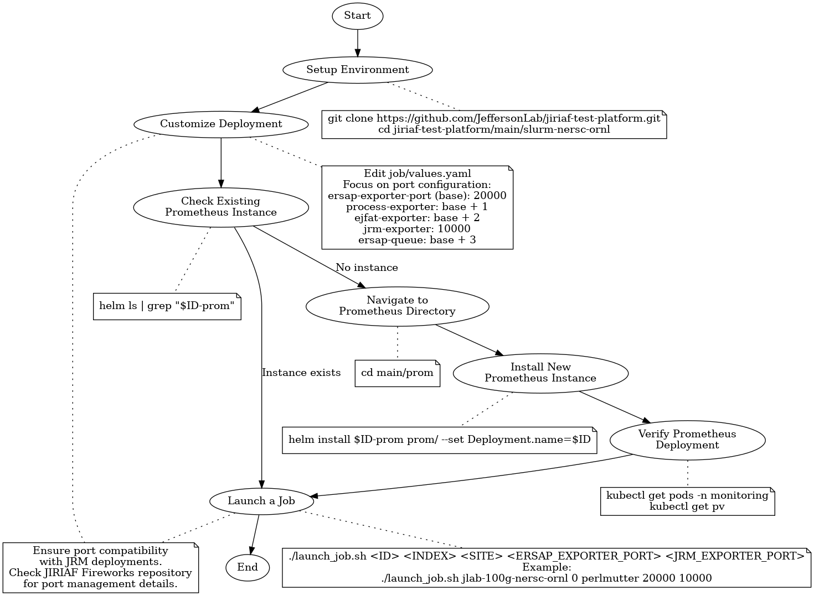

# Step-by-Step Guide: Using slurm-nersc-ornl Helm Charts

## Prerequisites
- Helm 3 installed
- Kubernetes cluster access
- kubectl configured


## Overview Flow Chart

The following flow chart provides a high-level overview of the process for using the slurm-nersc-ornl Helm charts:

 #[[File:slurm_nersc_ornl_flow_chart.png|SLURM NERSC-ORNL Flow Chart|1100px]]


This chart illustrates the main steps involved in deploying and managing jobs using the slurm-nersc-ornl Helm charts, from initial setup through job submission.


1. **Setup Environment**
   Clone the repository and navigate to the `slurm-nersc-ornl` folder:
   ```bash
   git clone https://github.com/JeffersonLab/jiriaf-test-platform.git
   cd jiriaf-test-platform/main/slurm-nersc-ornl
   ```

2. **Customize the Deployment**
   Open `job/values.yaml`
   Edit key settings, focusing on port configuration:
   ```
   ersap-exporter-port (base): 20000
   │
   ├─ process-exporter: base + 1 = 20001
   │
   ├─ ejfat-exporter:   base + 2 = 20002
   │
   ├─ jrm-exporter:     10000 (exception)
   │
   └─ ersap-queue:      base + 3 = 20003
   ```
   This structure allows easy scaling and management of port assignments.

3. **Deploy Prometheus (If not already running)**
    1. Refer to `main/prom/readme.md` for detailed instructions on installing and configuring Prometheus.

    2. Check if a Prometheus instance is already running for your project:
    ```bash
    helm ls | grep "$ID-prom"
    ```
    If this command returns no results, it means there's no Prometheus instance for your project ID.

    3. If needed, install a new Prometheus instance for your project:
    ```bash
    cd main/prom
    helm install $ID-prom prom/ --set Deployment.name=$ID
    ```
    4. Verify the Prometheus deployment before proceeding to the next step.

4. **Launch a Job**
    Use the `launch_job.sh` script:

    1. Open a terminal
    2. Navigate to the chart directory
    3. Run:
    ```shell
    ./launch_job.sh <ID> <INDEX> <SITE> <ERSAP_EXPORTER_PORT> <JRM_EXPORTER_PORT>
    ```
    Example:
    ```shell
    ./launch_job.sh jlab-100g-nersc-ornl 0 perlmutter 20000 10000
    ```

5. **Custom Port Configuration (if needed)**:
   1. Edit `launch_job.sh`
   2. Replace port calculations with desired numbers:
    ```bash
    ERSAP_EXPORTER_PORT=20000
    PROCESS_EXPORTER_PORT=20001
    EJFAT_EXPORTER_PORT=20002
    ERSAP_QUEUE_PORT=20003
    ```
   3. Save and run the script as described above

6. **Submit Batch Jobs (Optional)**
   For multiple jobs:
   1. Use `batch-job-submission.sh`:
   ```shell
   ./batch-job-submission.sh <TOTAL_NUMBER>
   ```
   2. Script parameters:
   - `ID`: Base job identifier (default: "jlab-100g-nersc-ornl")
   - `SITE`: Deployment site ("perlmutter" or "ornl", default: "perlmutter")
   - `ERSAP_EXPORTER_PORT_BASE`: Base ERSAP exporter port (default: 20000)
   - `JRM_EXPORTER_PORT_BASE`: Base JRM exporter port (default: 10000)
   - `TOTAL_NUMBER`: Total jobs to submit (passed as argument)

Note: Ensure port compatibility with JRM deployments. Check the [JIRIAF Fireworks repository](https://github.com/JeffersonLab/jiriaf-fireworks) for details on port management.

## Understand Key Templates
Familiarize yourself with:
- `job-job.yaml`: Defines Kubernetes Job
- `job-configmap.yaml`: Contains job container scripts
- `job-service.yaml`: Exposes job as Kubernetes Service
- `prom-servicemonitor.yaml`: Sets up Prometheus monitoring

## Site-Specific Configurations
The charts support Perlmutter and ORNL sites. Check `job-configmap.yaml`:

```12:17:main/slurm-nersc-ornl/job/templates/job-configmap.yaml
    {{- if eq .Values.Deployment.site "perlmutter" }}
        shifter --image=gurjyan/ersap:v0.1 -- /ersap/run-pipeline.sh
    {{- else }}
        export PR_HOST=$(hostname -I | awk '{print $2}')
        apptainer run ~/ersap_v0.1.sif -- /ersap/run-pipeline.sh
    {{- end }}
```

## Monitoring
The charts set up Prometheus monitoring. The [`prom-servicemonitor.yaml`](main/slurm-nersc-ornl/job/templates/prom-servicemonitor.yaml) file defines how Prometheus should scrape metrics from your jobs.

## Check and Delete Deployed Jobs

To check the jobs that are deployed, use:
```shell
helm ls
```
To delete a deployed job, use:

```shell
helm uninstall $ID-job-$SITE-<number>
```

Replace `$ID-job-$SITE-<number>` with the name used during installation (e.g., `$ID-job-$SITE-<number>`).

## Troubleshooting

- Check pod status: `kubectl get pods`
- View pod logs: `kubectl logs <pod-name>`
- Describe a pod: `kubectl describe pod <pod-name>`

This documentation provides a high-level overview of how to use and customize the Helm charts in the slurm-nersc-ornl folder. For more detailed information about specific components, refer to the individual files linked in this document.
