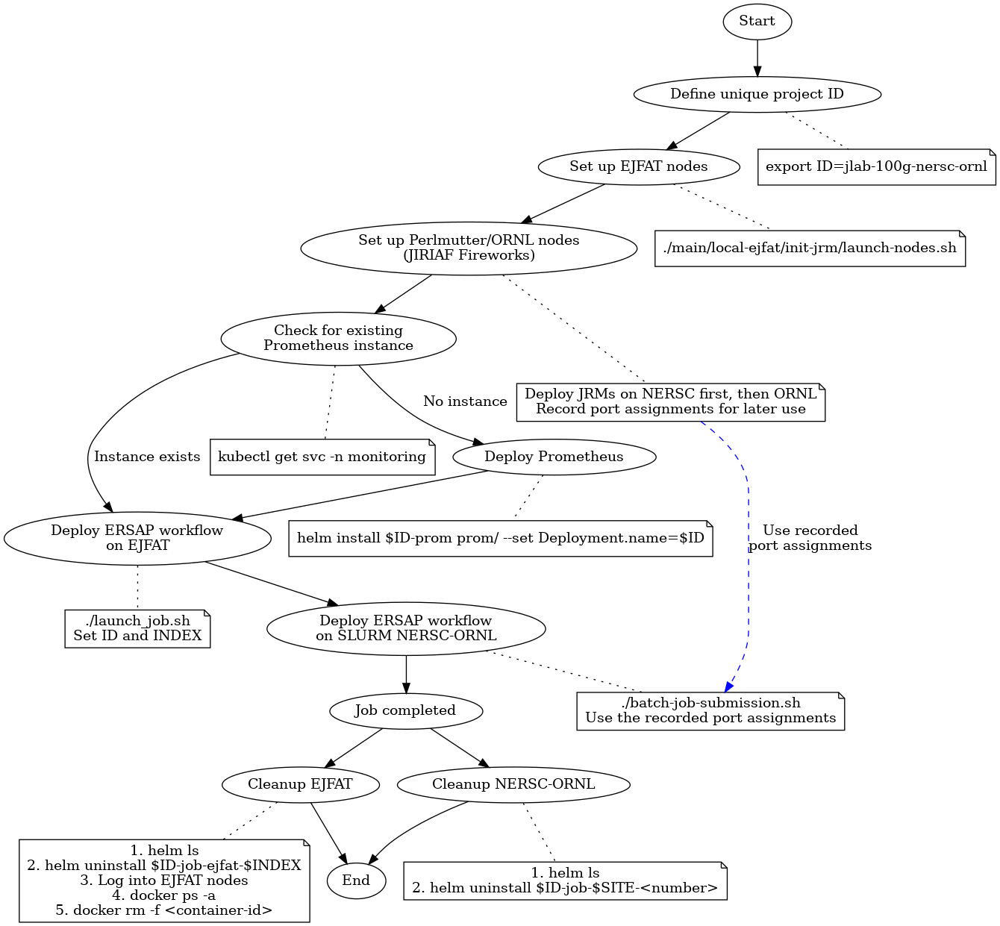

# Workflow Setup, Deployment, and Monitoring Guide in JIRIAF

This document provides a comprehensive guide for setting up and running ERSAP workflows in JIRIAF. It covers the following key aspects:

1. Project Identification: Defining a unique project ID for your workflow.
2. Prometheus Setup: Deploying a Prometheus instance for monitoring using Helm.
3. Workflow Deployment: Deploying workflows on EJFAT nodes and SLURM NERSC-ORNL nodes using Helm charts.
4. JRM Setup on Local EJFAT Nodes: Setting up JRM on EJFAT nodes.

## Prerequisites

Before you begin, ensure you have the following prerequisites in place:

1. Access to EJFAT, Perlmutter, and ORNL environments as required for your workflow.
2. Kubernetes cluster set up and configured.
3. `kubectl` command-line tool installed and configured to interact with your Kubernetes cluster.
4. Helm 3.x installed on your local machine.
5. Prometheus Operator installed on your Kubernetes cluster.
6. Access to the JIRIAF Fireworks repository (https://github.com/JeffersonLab/jiriaf-fireworks).
7. Sufficient permissions to deploy services and create namespaces in the Kubernetes cluster.
8. Basic understanding of Kubernetes, Helm, and SLURM concepts.
9. SSH access to relevant nodes (EJFAT, Perlmutter, ORNL) for deployment and troubleshooting.

Ensure all these prerequisites are met before proceeding with the workflow setup and deployment.

## Usage

For the simplest case to deploy ERSAP workflows, we ask to remove all the workflows and JRM instances, and then deploy the workflows.



1. Define a unique project ID:
   ```bash
   export ID=jlab-100g-nersc-ornl
   ```
   This ID will be used consistently across all deployment steps.

2. Set up EJFAT nodes:
   ```bash
   ./main/local-ejfat/init-jrm/launch-nodes.sh
   ```
   For detailed usage and customization, refer to the [EJFAT Node Initialization README](main/local-ejfat/init-jrm/readme.md).

3. Set up Perlmutter or ORNL nodes using JIRIAF Fireworks:
   Refer to the [JIRIAF Fireworks repository](https://github.com/JeffersonLab/jiriaf-fireworks) for detailed instructions on setting up the nodes for workflow execution. 
   
   **As this is the simplest case, we ask to deploy JRMs on NERSC first, and then ORNL.**

   **Important:** During this step, pay close attention to the port mappings created when deploying JRMs. These port assignments, specifically ERSAP_EXPORTER_PORT, PROCESS_EXPORTER_PORT, EJFAT_EXPORTER_PORT, and ERSAP_QUEUE_PORT, will need to be used in step 7 when deploying ERSAP workflows. Make sure to record these port assignments for each site (NERSC and ORNL) as they will be crucial for proper workflow deployment and monitoring.

4. Check if there is already a Prometheus instance for this ID:
   ```bash
   kubectl get svc -n monitoring
   ```
   If there is no Prometheus instance named `$ID-prom`, then deploy one by following the next step; otherwise, you can skip the next step.

5. Deploy Prometheus (skip this step if there is already a Prometheus instance for this ID):
   ```bash
   cd main/prom
   ID=jlab-100g-nersc-ornl
   helm install $ID-prom prom/ --set Deployment.name=$ID
   ```
   For more information on Prometheus deployment and configuration, see the [Prometheus Helm Chart README](main/prom/readme.md).

6. Deploy ERSAP workflow on EJFAT:
   ```bash
   cd main/local-ejfat
   ./launch_job.sh
   ```
   This script uses the following parameters:
   ```bash
   ID=jlab-100g-nersc-ornl 
   INDEX=1 # This should be a unique index for each workflow instance
   ```
   You can modify these parameters in the script as needed. For more details on EJFAT workflow deployment, consult the [Local EJFAT README](main/local-ejfat/readme.md).

7. Deploy ERSAP workflow on SLURM NERSC-ORNL:
   ```bash
   cd main/slurm-nersc-ornl
   ./batch-job-submission.sh
   ```
   This script uses the following default parameters:
   ```bash
   ID="jlab-100g-nersc-ornl" 
   SITE="perlmutter"
   ERSAP_EXPORTER_PORT_BASE=20000
   JRM_EXPORTER_PORT_BASE=10000
   TOTAL_NUMBER=2 # This is how many jobs will be deployed.
   ```
   You can modify these ports in the script `batch-job-submission.sh`. For more information on SLURM NERSC-ORNL workflow deployment, refer to the [SLURM NERSC-ORNL README](main/slurm-nersc-ornl/readme.md).

   **Critical:** The port values (ERSAP_EXPORTER_PORT, PROCESS_EXPORTER_PORT, EJFAT_EXPORTER_PORT, and ERSAP_QUEUE_PORT) used here must match the port assignments made during JRM deployment in step 3. Ensure that these ports align with the configuration in your site's setup. Before deployment, verify these port assignments and update them if necessary. Mismatched ports will result in monitoring failures and potential workflow issues.

These scripts automate the process of deploying multiple jobs, incrementing the necessary parameters (like port numbers and indices) for each job. This approach is more efficient for deploying multiple workflows in both the EJFAT and SLURM NERSC-ORNL environments.

## Components

### 1. EJFAT Node Initialization

The Experimental JLab Facility for AI and Test (EJFAT) nodes are initialized using scripts in the `init-jrm` directory. These scripts set up the environment for deploying workflows.

Key components:
- `node-setup.sh`: Sets up individual EJFAT nodes
- `launch-nodes.sh`: Launches multiple EJFAT nodes

For detailed information, see the [EJFAT Node Initialization README](main/local-ejfat/init-jrm/readme.md).

### 2. Local EJFAT Helm Charts

These charts are used to deploy workflows on EJFAT nodes. 

Key features:
- Main chart located in the `job/` directory
- Customizable deployment through `values.yaml`
- Includes templates for jobs, services, and monitoring

For usage instructions and details, refer to the [Local EJFAT README](main/local-ejfat/readme.md).

### 3. SLURM NERSC-ORNL Helm Charts

These charts are designed for deploying workflows on Perlmutter and ORNL environments.

Key features:
- Supports site-specific configurations (Perlmutter and ORNL)
- Includes scripts for batch job submission
- Integrates with Prometheus monitoring

For detailed usage instructions, see the [SLURM NERSC-ORNL README](main/slurm-nersc-ornl/readme.md).

### 4. Prometheus Monitoring

A custom Prometheus Helm chart sets up monitoring for the entire JIRIAF system.

Key components:
- Prometheus Server
- Persistent Volume for data storage
- Create Empty Dir for persistent storage

For in-depth information, consult the [Prometheus Helm Chart README](main/prom/readme.md).

## Workflow Integration

The system is designed for seamless integration of workflows across different environments:

1. Initialize EJFAT nodes using the `init-jrm` scripts.
2. Deploy the Prometheus monitoring system using the provided Helm chart.
3. Deploy workflows on EJFAT nodes using the Local EJFAT Helm charts.
4. Deploy workflows on Perlmutter or ORNL using the SLURM NERSC-ORNL Helm charts.

All deployed workflows can be monitored by the single Prometheus instance, providing a unified view of the entire system.

## Customization

Each component (EJFAT, SLURM NERSC-ORNL, Prometheus) can be customized through their respective `values.yaml` files and additional configuration options. Refer to the individual README files for specific customization details.

## Troubleshooting

- Use standard Kubernetes commands (`kubectl get`, `kubectl logs`, `kubectl describe`) to diagnose issues.
- Check Prometheus metrics and alerts for system-wide monitoring.

For component-specific troubleshooting, consult the relevant README files linked above.
